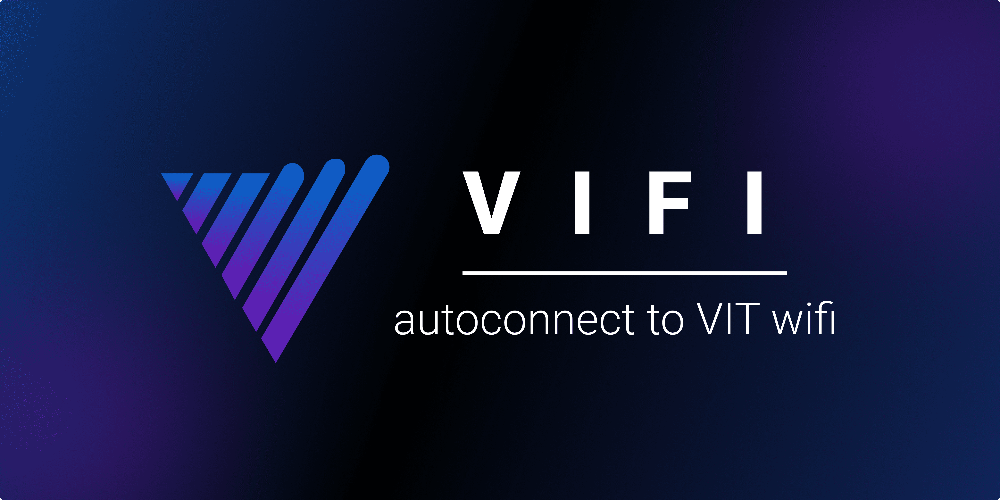

# ViFi

## About

An extension made to help VIT students connect to their WiFi seamlessly !!

## Tech Stack

- Javascript
- Chrome API

## Installing the extension

- Clone the repo.
  `https://github.com/guptaharsh13/vifi`
- Launch Google Chrome and type `chrome:/extensions/` into the address bar, then hit enter
- Switch on `Developer mode` in the top-right corner
- You would now have an option to `Load unpacked` in the top-left corner
- Click it, then navigate to the cloned repo and select the `extension` folder
- Congratulations, your extension has been successfully installed !!

## Using the extension

- Once the extension is installed, click on the extension icon to save your Username and Password
- Don't worry, it's completely safe
- Your Username and Password are only stored locally on your device
- That's it, you're all set to automatically login to your VIT WiFi the next time you connect !!

### Shortcuts

- Ctrl + Shift + V - To automatically login to your VIT WiFi
- Ctrl + Shift + L - To logout to your VIT WiFi

## Getting Started

To get started -

- Clone the repo.
  `https://github.com/guptaharsh13/vifi`
- Checkout to a new branch.
  `git checkout -b my-amazing-feature`
- Make some amazing changes.
- `git add .`
- `git commit -m "<verb> : <action>."`
- `git push origin my-amazing-feature`
- Open a pull request :)

To start contributing, check out [`CONTRIBUTING.md`](https://github.com/guptaharsh13/vifi/blob/main/CONTRIBUTING.md) . New contributors are always welcome to support this project.

## Contributors ✨

- [Kavipriya A](https://kavipriya.super.site/) (Design)

## License

This project is licensed under [MIT](https://github.com/guptaharsh13/vifi/blob/master/LICENSE).

Made with ❤ by Harsh Gupta

